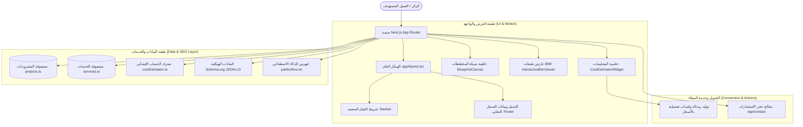

# منصة مكتب إنشاء للاستشارات الهندسية والتصميم المعماري
## Inshaa Engineering Consultancy & Architectural Studio Web Platform

> موقع ويب إنتاجي فائق الأداء والسرعة، مطور بتقنية **Next.js LTS (App Router)** واللغة العربية (**RTL-First**)، مخصص لمكاتب الاستشارات الهندسية في مصر وفقاً لاشتراطات **كود البناء المصري (ECP)** واعتمادات **نقابة المهندسين المصرية**.

---

## 🏗️ 1. الميزات الرئيسية (Key Features)

- **هوية بصرية معمارية بالثيم الفاتح (Architectural Light Theme):** مستوحاة من ورق المخططات الهندسية ومساطر الرسم الكلاسيكية وخطوط الأوتوكاد الدقيقة.
- **مبدل طبقات BIM التفاعلي (Interactive BIM/CAD Layer Switcher):** استعراض حي للمشاريع عبر التبديل السلس بين:
  - 1. المساقط المعمارية والتنفيذية (Architectural Working Drawings)
  - 2. النموذج الإنشائي ومخططات التسليح (Structural Finite Element)
  - 3. الشبكات الكهروميكانيكية والتكييف (MEP Coordination)
  - 4. الريندر الواقعي النهائي بدقة 4K
- **حاسبة المقايسات وتكلفة البناء التفاعلية (Real-Time Cost Estimator):** احتساب فوري لأتعاب التصميم والاستشارات والإشراف الميداني وميزانية التشييد بالسوق المصري.
- **شبكة كانفاس هندسية تفاعلية (21st.dev Style Blueprint Canvas):** مؤثرات بصرية ناعمة تتبع المؤشر مع مؤشرات CAD المتقاطعة بدون التأثير على سرعة التحميل.
- **منظومة متكاملة لـ SEO و GEO (Generative Engine Optimization):**
  - توافق كامل مع روبوتات الذكاء الاصطناعي (ChatGPT, Claude, Google AI Overviews, Perplexity).
  - ملف معايير `/llms.txt`.
  - بيانات هيكلية معتمدة عبر Schema.org JSON-LD (`EngineeringService`, `LocalBusiness`, `FAQPage`, `Project`).
- **خطوط عربية معمارية رصينة:** استخدام خطي `Cairo` و `IBM Plex Sans Arabic` مع خط `JetBrains Mono` للأرقام والأبعاد الهندسية.

---

## 🏛️ 2. المعمارية الفنية (System Architecture)



---

## 📁 3. هيكل الملفات والمجلدات (Project Directory Structure)

```text
Inshaa/
├── app/
│   ├── layout.tsx                    # الهيكل الجذري (RTL, Dir="rtl", Cairo Font, JSON-LD)
│   ├── page.tsx                      # الصفحة الرئيسية (9 أقسام هندسية متكاملة)
│   ├── about/page.tsx                # عن المكتب، الاعتمادات، التاريخ، والهيكل الاستشاري
│   ├── services/
│   │   ├── page.tsx                  # دليل الخدمات الاستشارية + FAQ
│   │   └── [slug]/page.tsx           # تفاصيل التخصص ومراحل العمل والمخرجات الهندسية
│   ├── projects/
│   │   ├── page.tsx                  # معرض الأعمال القابل للفلترة
│   │   └── [slug]/page.tsx           # دراسة حالة المشروع (مخططات، كميات، وتحديات الموقع)
│   ├── calculator/page.tsx           # حاسبة تكاليف المشروعات ومقايسات التنفيذ
│   ├── contact/page.tsx              # حجز موعد استشارة مع مهندس استشاري وإرفاق ملفات CAD
│   ├── not-found.tsx                 # صفحة 404 بتصميم معماري
│   ├── sitemap.ts                    # خريطة الموقع لمحركات البحث
│   ├── robots.ts                     # توجيهات الزحف وروبوتات الذكاء الاصطناعي
│   └── api/contact/route.ts          # معالج استمارات الحجز
├── components/
│   ├── home/                         # مكونات الصفحة الرئيسية (Hero, Stats, BIM Viewer, Calculator)
│   ├── layout/                       # Navbar, Footer, MobileMenu
│   ├── motion/                       # BlueprintCanvas, FadeInView
│   ├── ui/                           # Button, Card, Badge, Slider, Modal, SectionHeading
│   └── seo/                          # JsonLd component
├── lib/
│   ├── data/                         # projects.ts, services.ts, team.ts, testimonials.ts, costEstimator.ts
│   ├── seo.ts                        # مساعد إعداد الميتا تاج والعناوين
│   └── utils.ts                      # دوال الفئات والتحويل
├── public/
│   └── llms.txt                      # التوثيق المعياري لأنظمة الذكاء الاصطناعي
├── tests/
│   └── unit/                         # اختبارات محرك الحاسبة والميتا تاج (Vitest)
├── .github/workflows/ci.yml          # مسار الـ CI/CD الآلي
├── vercel.json                       # إعدادات النشر على Vercel باسم inshaa-engineering
├── tailwind.config.ts                # إعدادات Tailwind والألوان الهندسية
└── package.json
```

---

## 🚀 4. التشغيل والتطوير المحلي (Quick Start)

### المتطلبات الأساسية
- **Node.js**: الإصدار 18.18 أو أعلى (يوصى بـ Node.js 20 LTS).
- **npm** أو **pnpm**.

### خطوات التثبيت والتشغيل

1. **استنساخ المستودع:**
   ```bash
   git clone https://github.com/MahmoudMosTafa717/Inshaa.git
   cd Inshaa
   ```

2. **تثبيت الاعتمادات:**
   ```bash
   npm install
   ```

3. **تشغيل خادم التطوير المحلي:**
   ```bash
   npm run dev
   ```
   افتح المتصفح على الرابط: [http://localhost:3000](http://localhost:3000).

4. **تنفيذ الاختبارات الآلية (Unit Tests):**
   ```bash
   npm run test
   ```

5. **بناء نسخة الإنتاج (Production Build):**
   ```bash
   npm run build
   ```

---

## 🛡️ 5. معايير الجودة والاعتماد الهندسي المصري

- **الرقم النقابي:** مسجل بسجل المكاتب الاستشارية بنقابة المهندسين المصرية برقم `1248/خ`.
- **الأكواد المعتمدة:**
  - الكود المصري لتصميم وتنفيذ المنشآت الخرسانية المسلحة **ECP 203**.
  - كود حساب الأحمال والقوى في أعمال المباني والزلازل **ECP 201**.
  - قانون البناء الموحد رقم **119 لسنة 2008** واشتراطات هيئة المجتمعات العمرانية الجديدة.

---

## 📄 6. الترخيص (License)

هذا المشروع مطور لمكتب **إنشاء للاستشارات الهندسية والتصميم المعماري**. جميع الحقوق محفوظة © 2025/2026.
