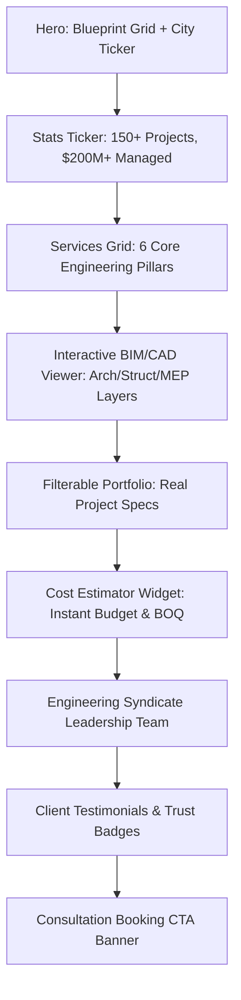

# Homepage Engineering Architecture (`components/home/`)

## 1. Feature Overview & User Journey
The Inshaa Homepage is structured as an authoritative, high-conversion engineering landing platform. It guides potential real estate investors and villa owners through a logical trust progression:

## 2. Components Breakdown
| Component | Rendering Mode | Purpose |
| :--- | :--- | :--- |
| `HeroSection.tsx` | Client (`use client`) | Interactive 21st.dev style blueprint canvas backdrop with quick quote button. |
| `StatsTicker.tsx` | Server Component | Certified engineering metrics & Egyptian syndicate registration proof. |
| `ServicesGrid.tsx` | Server Component | 6-pillar engineering competencies with deliverable previews. |
| `InteractiveBimViewer.tsx` | Client (`use client`) | Layer toggle for architectural 3D wireframes, structural load models, MEP networks, and final photorealistic renders. |
| `PortfolioSection.tsx` | Client (`use client`) | Categorized project gallery (Villas, Commercial, Administrative, Interior). |
| `CostEstimatorWidget.tsx` | Client (`use client`) | Real-time calculation engine with area slider and direct WhatsApp quote dispatcher. |
| `TeamSection.tsx` | Server Component | Registered consulting engineers with Egyptian Engineering Syndicate numbers. |
| `TestimonialsSection.tsx` | Server Component | Verified client reviews across New Cairo, Zayed, and New Capital. |
| `ConsultationCta.tsx` | Server Component | Fast consultation scheduling and direct hotline access. |

## 3. SEO & GEO Optimization
- Server-side rendered primary text ensures full crawlability for Googlebot, GPTBot, and PerplexityBot.
- Injected `LocalBusiness` and `Organization` JSON-LD microdata.
