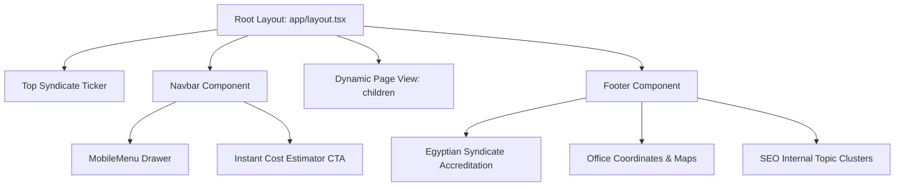

# Architectural Layout Module (`components/layout/`)

## 1. Overview & Business Objectives
The Layout module establishes the structural frame and persistent visual trust anchors of the Inshaa Engineering platform. It enforces:
- **Syndicate & Authority Visibility:** Continuous display of the Egyptian Engineering Syndicate registration number (`1248/خ`) and regional authority approvals (New Cairo, Sheikh Zayed, New Capital, 6th of October).
- **RTL-First Navigation:** Seamless right-to-left layout transitions, accessible mobile slide-over drawers, and direct click-to-call / WhatsApp CTAs.

## 2. Component Hierarchy & Props
- **`Navbar.tsx` (`use client`):** Sticky header featuring responsive navigation links, scroll detection, and rapid consultation CTA.
- **`Footer.tsx` (Server Component):** Comprehensive footer rendering office locations, tax IDs, commercial registration, ISO certifications, and schema-aligned internal links.
- **`MobileMenu.tsx` (`use client`):** Lightweight slide-down menu tailored for mobile touch ergonomics (375px - 430px viewports).

## 3. SEO & GEO Capabilities
- Semantic `<header>`, `<nav>`, and `<footer>` landmarks.
- Canonical address markup and geo-coordinates matching Google Local Pack data.
